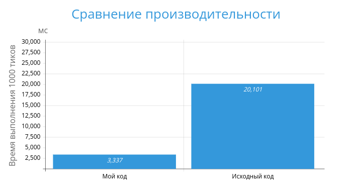
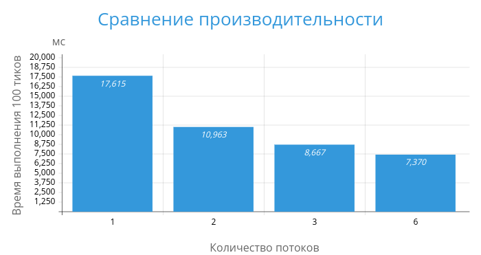

# Отчет: Домашнее задание 2 и 3

## Выполненные изменения и улучшения

### 1. Добавленные типы для чисел с фиксированной запятой
- **FIXED(N, K):** 
  Использует `intN_t` для представления чисел с фиксированной точкой, где:
  - `N` определяет количество битов (8, 16, 32, 64).
  - `K` задает количество бит для дробной части.

- **FAST_FIXED(N, K):**
  Аналогично FIXED(N, K), но вместо `intN_t` используется `int_fastN_t`, что может быть быстрее на некоторых архитектурах.

### 2. Предкомпиляция поля статического размера
- При компиляции программы заранее создаются версии симуляции для различных размеров поля.
- Если размеры поля, указанные во время выполнения, совпадают с предкомпилированными, используются статические массивы (`std::array`).
- Для остальных размеров поля применяются динамические массивы (`std::vector`).

### 3. Выделение симуляции воды в отдельный шаблонный класс
- **FluidSim**: Новый шаблонный класс для симуляции воды.
  - Параметры шаблона:
    1. Тип данных для плотности (p-type).
    2. Тип данных для скорости (v-type).
    3. Тип данных для потока скорости (v-flow-type).
    4. Размер поля (опционально).

### 4. Выбор параметров в runtime через аргументы командной строки
- **--p-type**: Тип данных для плотности.
- **--v-type**: Тип данных для скорости.
- **--v-flow-type**: Тип данных для потока скорости.
- **--field-path**: Путь к файлу с полем для инициализации симуляции.

### 5. Сохранение состояния симуляции
- Во время выполнения программы при нажатии **CTRL-C**:
  - Текущие данные симуляции сохраняются в файл.
  - Путь к файлу сохраняемого состояния выводится в консоль.
  - Продолжается работа симуляции.

### 6. Загрузка сохраненного состояния
- Для загрузки состояния симуляции:
  - Укажите путь к сохраненному состоянию с помощью аргумента командной строки **--load-path**.

### 7. Указание доступных типов и размеров при компиляции
- Для задания доступных типов необходимо использовать флаг компиляции **-DTYPES**:
  ```
  -DTYPES=FIXED(64,10), DOUBLE, FLOAT, FAST_FIXED(32,16), ...
  ```
  (Важно: без пробелов после запятой внутри скобок).

- Для задания статических размеров используйте флаг компиляции **-DSIZES**:
  ```
  -DSIZES=S(34,86), S(64,128), ...
  ```
  (Важно: без пробелов после запятой внутри скобок).

## Пример использования

### Компиляция программы
```bash
cmake   -S . \
        -B build \
        -DTYPES="FAST_FIXED(32,16), FIXED(64,8)" \
        -DSIZES="S(10,10), S(34,86)"

cmake --build build
```

### Запуск с динамическим размером поля
```bash
./build/Fluid   --p-type="FAST_FIXED(32,16)" \
                --v-type="FAST_FIXED(32,16)" \
                --v-flow-type="FAST_FIXED(32,16)" \
                --field-path=base_field
```

### Загрузка сохраненного состояния
```bash
./build/Fluid --load-path=saved_state
```

### Пример сохранения во время выполнения
- Нажмите **CTRL-C** во время работы программы.
- Пример вывода:
  ```
  Simulation saved to save_1545
  ```


## Выполненные изменения и улучшения

### 1. Возможность параллельного запуска и выбора количества потоков
- Добавлена поддержка многопоточности.
- Количество потоков задается через аргумент командной строки **--num-threads**:
  - Если аргумент не указан, программа запускается в одном потоке.
  - Пример запуска:
    ```bash
    ./build/Fluid   --p-type="FAST_FIXED(32,16)" \
                --v-type="FAST_FIXED(32,16)" \
                --v-flow-type="FAST_FIXED(32,16)" \
                --field-path=base_field \
                --num-threads=10
    ```

### 2. Оптимизации без использования параллельности
- **Использование типа FAST_FIXED:**
  Улучшена производительность операций за счет замены типов данных на `FAST_FIXED`.
- **Ускорение поиска индекса в `deltas`:**
  Реализована более быстрая структура данных для ускорения поиска.
- **Оптимизация обмена ячеек:**
  В функции `swap_with` выполняется обмен сразу двух ячеек в один этап, вместо использования дополнительных переменных в два этапа.

### 3. Анализ производительности
- Выполнено сравнение времени выполнения кода для 1000 тиков поля из условия до и после оптимизаций в однопоточном режиме.


### 4. Анализ длительности работы функций
- Построена круговая диаграмма для выявления наиболее затратных функций.

Делаем вывод, что самая времязатратная функция это обновление сокростей, а именно многократный вызов `propagate_flow`.

### 5. Параллельная реализация функции `propagate_flow`
- Реализован параллельный обход поля с разбиением на блоки одинакового размера.
- Для корректной работы дополнительно делаются обходы вдоль границ блоков.

### 6. Сравнение производительности в многопоточном режиме
- Выполнены замеры времени выполнения программы на большом поле размера 50x150 до 100 тика при разном количестве потоков.


## Пример использования

### Запуск с многопоточностью
```bash
./build/Fluid   --p-type="FAST_FIXED(32,16)" \
                --v-type="FAST_FIXED(32,16)" \
                --v-flow-type="FAST_FIXED(32,16)" \
                --field-path=test_field \
                --num-threads=8
```